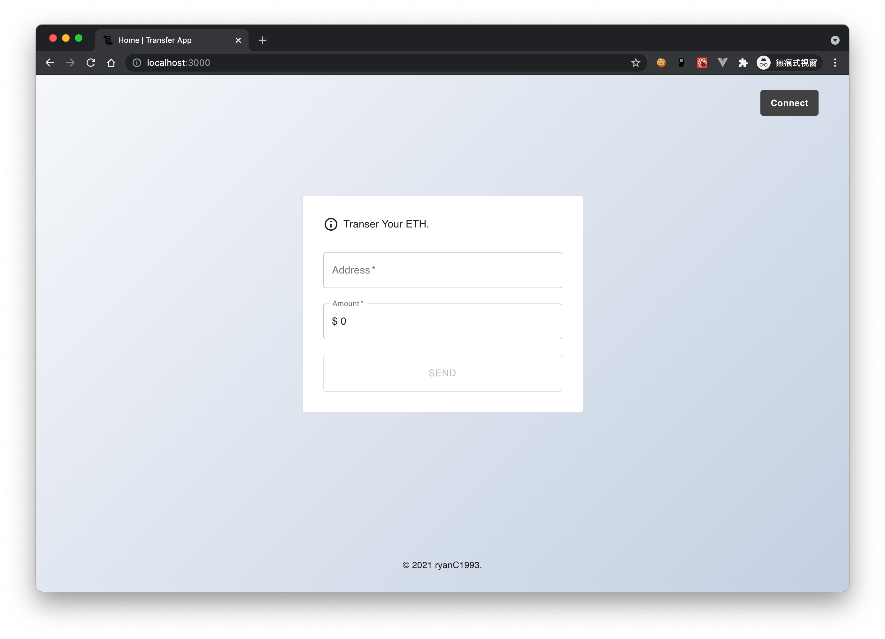

# Transfer App
This project was bootstrapped with [Create React App](https://github.com/facebook/create-react-app).



## Built with
- react (v17.0.2)
- @material-ui/core (v4.12.3)
- @web3-react/core (v6.1.9)
- @web3-react/injected-connector (v6.0.7)
- ethers (v5.4.6)
- react-number-format (v4.7.3)
- react-hook-form (v7.14.0)

## File Structure
The mainly structure is as below:
```
transfer-app
├── package.json
├── src
│   ├── assets/     (icons.)
│   ├── components/
│   ├── connectors/ (support wallet connectors.)
│   ├── constants/  (support chain ids.)
│   ├── hooks/
│   ├── state/      (react context & updaters.)
│   ├── theme/
│   ├── utils/
│   ├── App.js
│   ├── index.js    (entry point.)
├── ...
├── ..
├── .
```

## Develop
```bash
# install dependencies
$ yarn
# serve with hot reload at localhost:3000
$ yarn start
```

## Build
``` bash
# install dependencies
$ yarn

# build for production
$ yarn build
```